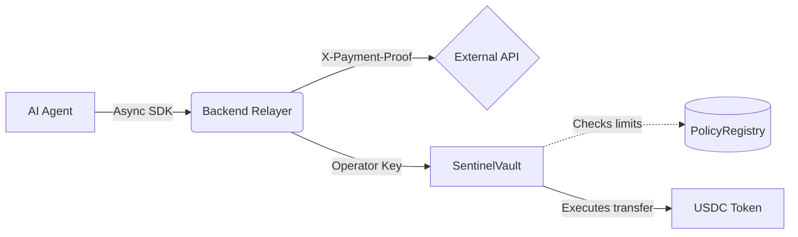

<div align="center">
  
  
  # SentinelPay
  
  **Secure, On-Chain Policy Enforcement for Celo AI Agents**

  [](https://sentinelpay.vercel.app/)
  [](https://opensource.org/licenses/MIT)
  [](https://celoscan.io/)

  *Built for the **Celo Hackathon: Track 2 (Agent Infrastructure)***

  [**Live Web Demo**](https://sentinelpay.vercel.app/) • [**Architecture Docs**](docs/ARCHITECTURE.md) • [**SDK Guide**](docs/DEMO_GUIDE.md)
</div>

---

## 🚀 The Problem: Blind Trust in AI

AI agents are rapidly becoming autonomous and integrating into financial workflows. But currently, giving an AI agent the ability to spend money means giving it a private key in a "blind trust" model. This leads to critical risks:
- **Policy Drift:** AI hallucinations causing massive overspending or draining of funds.
- **Security Breaches:** Private keys hardcoded in agent runtimes being leaked.
- **Opacity:** No verifiable on-chain audit trail for "good acting" agents.

## 🛡️ The Solution: SentinelPay

SentinelPay is a security-first infrastructure layer that separates **Financial Authority** (Smart Contracts) from **Agent Logic** (AI).

By moving the policy engine on-chain, SentinelPay guarantees deterministic, trustless execution. Operators set the rules; the blockchain enforces them. Even if an AI agent goes completely rogue, the financial blast radius is strictly contained.

### Track 2 (Agent Infra) Optimizations
We have hyper-optimized SentinelPay to serve as the foundational infrastructure for thousands of Celo agents:
* ⚡ **$O(1)$ Gas Efficiency:** The `PolicyRegistry.sol` whitelist engine uses a nested mapping for instantaneous, $O(1)$ on-chain verifications, keeping infrastructure costs negligible.
* 🚀 **Async-First Python SDK:** Includes `AsyncSentinelPayClient` built on `httpx`. Since modern agent frameworks (Langchain, AutoGPT) are async-native, this allows developers to seamlessly drop SentinelPay into their non-blocking event loops.
* 🛡️ **Defense in Depth:** Dual-layer security featuring HMAC/idempotency request signatures off-chain, backed by immutable smart contract constraints on-chain.

---

## 🏗️ Architecture



1. **User / Operator Layer:** A physical user funds the `SentinelVault` and configures the `PolicyRegistry` on-chain (max per tx, daily caps, whitelists).
2. **AI Agent Layer (`AsyncSentinelPayClient`):** The agent requests a payment via the backend using secure HMAC signatures. It never touches a private key.
3. **Smart Contract Layer (`SentinelVault.sol`):** The vault cryptographically verifies that the requested payment perfectly adheres to the on-chain policy before releasing funds.

---

## 🎮 The "Rogue Agent" Demo

We built a specific simulator to prove the infrastructure works deterministically under stress. Try it out!

```bash
# Terminal 1: Start backend
cd backend
pip install -r requirements.txt
cp .env.example .env # Configure Celo RPC and Vault Address
uvicorn main:app --host 0.0.0.0 --port 8000

# Terminal 2: Unleash the Rogue Agent
python3 backend/scripts/rogue_agent_demo.py
```
Watch as the AI attempts to siphon funds to an unauthorized address or overspend its daily limit, only to be seamlessly rejected by the Celo smart contract policy engine returning a highly descriptive revert reason.

---

## 💻 Quickstart (Web Demo)

If you'd rather see the full stack in action visually:

1. **Visit [sentinelpay.vercel.app](https://sentinelpay.vercel.app)**
2. Connect your wallet (Celo Sepolia).
3. Navigate to the **Demo** tab.
4. Hit **Run Demo**. 

You'll watch the backend synthesize live Web2 Data (Weather/Market APIs) immediately after the smart contract settles the sub-second USDC payment on the Celo network.

---

## 📦 Developer SDK

Integrating into your own agent is a 3-line process:

```python
from sentinelpay import AsyncSentinelPayClient

async def run_agent():
    # Instantiate the async, non-blocking client
    client = AsyncSentinelPayClient("https://your-backend.example", agent_id="trade_bot")
    
    # Attempt an on-chain execution
    try:
        tx = await client.execute_payment(amount=1.50, recipient="0xWhitelisted...")
        print(f"Payment successful: {tx['tx_hash']}")
    except Exception as e:
        print(f"Policy violation prevented payment: {e}")
```

---

## 🔮 Roadmap

* **Phase 1 (MVP) ✅:** Core infrastructure, Python Async SDK, On-chain policy enforcement, Dashboard observability.
* **Phase 2:** Multi-agent UX (multiple `agent_ids` bound to a single vault), robust ERC-8004 identity integration.
* **Phase 3:** Open developer platform, Celo Mainnet deployment, "Good Actor" automated agent reputation scoring.
* **Phase 4:** DAO-controlled governance for agent global spending limits.

## 📄 License
MIT License. Built with ❤️ for the Celo Ecosystem.
