# SentinelPay: Architecture

SentinelPay is built as a layered infrastructure to provide maximum security for autonomous AI agents on Celo. It separates **Decision Authority** (the Agent) from **Financial Authority** (the Smart Contract).

## High-Level Workflow

The following diagram illustrates how an Agent interacts with the SentinelPay infrastructure to execute a secure payment.

```mermaid
sequenceDiagram
    participant Agent as AI Agent (Python SDK)
    participant Backend as SentinelPay Backend API
    participant Vault as SentinelVault (Smart Contract)
    participant Registry as PolicyRegistry (Smart Contract)
    participant Celo as Celo Blockchain (USDC)

    Agent->>Backend: POST /execute-payment (Amount, Recipient)
    Note over Agent,Backend: Signed with HMAC Secret (optional)
    
    Backend->>Vault: executePayment(agentId, recipient, amount)
    
    rect rgb(20, 20, 40)
        Note right of Vault: On-Chain Policy Enforcement
        Vault->>Registry: isAgentActive(agentId)?
        Registry-->>Vault: Yes
        Vault->>Registry: isWhitelisted(agentId, recipient)?
        Registry-->>Vault: Yes
        Vault->>Vault: Check maxPerTx Limit
        Vault->>Vault: Check Daily Cap Reset
        Vault->>Vault: Check Daily Budget
        Vault->>Vault: Check Vault Balance
    end

    alt Policy Pass
        Vault->>Celo: Transfer USDC to Recipient
        Celo-->>Vault: Success (TX Hash)
        Vault-->>Backend: PaymentExecuted Event
        Backend-->>Agent: 200 OK (TX Hash)
    else Policy Fail
        Vault-->>Backend: Revert (Reason)
        Backend-->>Agent: 400 Bad Request (Revert Reason)
    end
```

## Core Components

### 1. SentinelPay Python SDK
A lightweight wrapper that handles:
- **Authentication:** HMAC request signing using a shared secret.
- **Idempotency:** Automatic generation of keys to prevent double-spending.
- **Communication:** Clean interface for agents to request payments and check balances.

### 2. Guardrails API (Backend)
The stateless middle layer that:
- **Validates Requests:** Checks HMAC signatures and Operator keys.
- **Execution:** Interface with the Celo blockchain using `web3.py`.
- **Observability:** Stores execution results (tx hash, status, metadata) in a local database for the dashboard.

### 3. Guardian Protocol (Smart Contracts)
The source of truth for security. Rules are enforced on-chain; policy values are owner-updatable.
- **SentinelVault:** Owns the funds. Only the owner (the backend/admin) can trigger payments, and only if they pass all checks.
- **PolicyRegistry:** Stores the specific limits (Max Tx, Daily Cap, Whitelist) for each agent ID.

## Security Model: "Defense in Depth"

SentinelPay employs a multi-layered security model:
1. **Network Layer:** API keys and rate limiting.
2. **Application Layer:** Optional HMAC signatures ensure the request actually came from your agent.
3. **Logic Layer:** Idempotency keys prevent "retry loops" from draining funds.
4. **Protocol Layer (Final Boss):** Even if agent logic is compromised, the smart contract will **revert** any transaction that exceeds the pre-set limits or pays a non-whitelisted address (assuming the owner key/policy remains secure).
